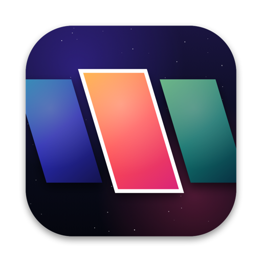
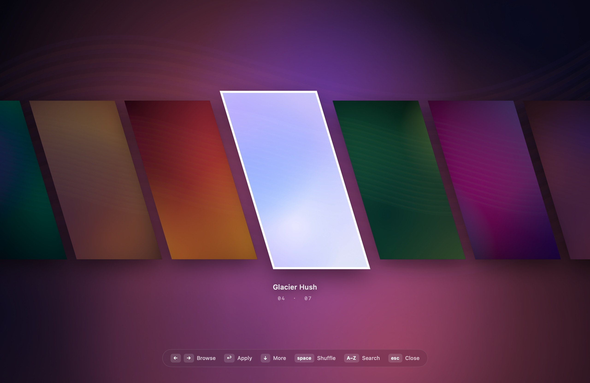
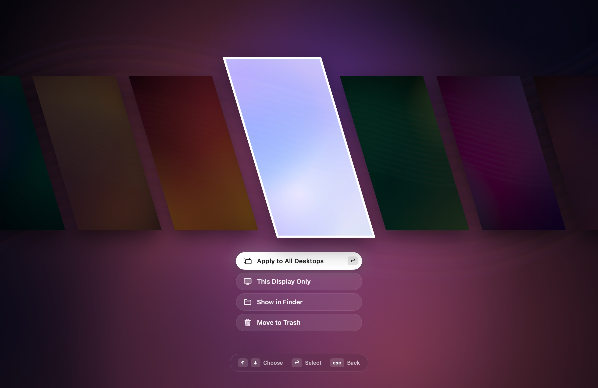
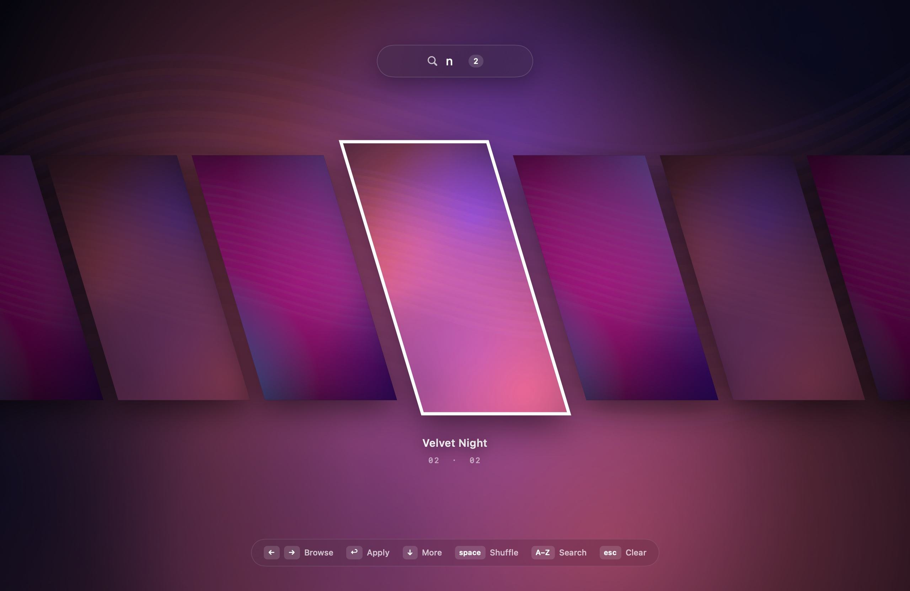

<p align="center">
  
</p>

<h1 align="center">SlickWallpapers</h1>

<p align="center">
  A smooth, animated wallpaper selector for macOS, in the spirit of the Quickshell pickers on Linux.<br>
  Press <b>⇧⌘W</b>, browse with the arrow keys, press <b>Enter</b>.
</p>

<p align="center">
  <a href="https://github.com/OhTheGreatGitsby/SlickWallpapers/releases/latest"><b>Download</b></a> ·
  <a href="#install">Install</a> ·
  <a href="#controls">Controls</a> ·
  <a href="CHANGELOG.md">Changelog</a>
</p>



Your wallpapers fly in as a row of slanted cards. Browse them and press **Enter**. The card you picked straightens out and grows to fill the screen, then becomes your wallpaper.

## Features

- **Animated card selector:** slanted cards with a parallax effect, spring-based motion, and cards that fly in one after another.
- **Smooth switch:** the selected card expands to fill the screen at full resolution. The real wallpaper is then set underneath it, and the overlay fades away.
- **Live wallpapers:** put an `.mp4` or `.mov` in your folder and it plays as a looping, muted video behind your desktop icons. The focused card plays a preview.
- **More options with ↓:** apply to all desktops (every Space), apply to this display only, show in Finder, or move to Trash.
- **Type to search:** start typing a name and the row filters as you type.
- **Shuffle:** press **space** to spin to a random wallpaper, or let Auto Shuffle change it on a timer with a slow desktop crossfade.
- **Loops around:** the row never ends; after the last wallpaper comes the first.
- **Settings:** choose your own hotkey, wallpapers folder, animation speed (Relaxed, Default or Snappy), looping, Reduce Motion, Auto Shuffle and launch at login.
- **Light on memory:** previews load on demand and only a small number stay in memory, so large folders stay fast.
- **Accessible:** respects the macOS Reduce Motion setting.
- **Native:** Swift + SwiftUI with no dependencies. It runs as a menu bar app with no Dock icon and needs no special permissions.

<table>
  <tr>
    <td></td>
    <td></td>
  </tr>
</table>

## Install

### Download

1. Download **SlickWallpapers.zip** from the [latest release](https://github.com/OhTheGreatGitsby/SlickWallpapers/releases/latest) and unzip it.
2. Move **SlickWallpapers.app** to your Applications folder.
3. Open it. The app isn't notarized by Apple, so macOS will block it the first time. Go to **System Settings › Privacy & Security**, scroll down, and click **Open Anyway**. Alternatively, run:
   ```sh
   xattr -dr com.apple.quarantine /Applications/SlickWallpapers.app
   ```

### Homebrew

```sh
brew install --cask ohthegreatgitsby/tap/slickwallpapers
```

### Build from source

Requirements: macOS 14 or later and the Xcode Command Line Tools (`xcode-select --install`).

```sh
git clone https://github.com/OhTheGreatGitsby/SlickWallpapers.git
cd SlickWallpapers
./build.sh            # builds, installs to ~/Applications and launches
./build.sh --release  # universal build zipped into dist/
```

On first launch, SlickWallpapers opens its Settings window, creates `~/Wallpapers`, and registers itself to start at login (you can turn that off in Settings). Put images or videos into that folder and press **⇧⌘W**.

To remove it, run `./uninstall.sh` (or `brew uninstall --cask slickwallpapers`). Your wallpapers folder is left untouched.

## Controls

| Key | Action |
| --- | --- |
| **⇧⌘W** | Open or close the selector (change it in Settings) |
| **← →** | Browse (trackpad swipe, scroll wheel and clicking also work) |
| **↩** | Apply |
| **↓** | More options: All Desktops, This Display Only, Show in Finder, Move to Trash |
| **space** or **⇥** | Shuffle: spin to a random wallpaper |
| **A–Z, 0–9** | Search; **⌫** deletes a character |
| **esc** | Close the options, clear the search, or close the selector |
| **⌘⌫** | Move to Trash |
| **⌘R** | Show in Finder |
| **⌘O** | Open the wallpapers folder |
| **⌘,** | Settings |

The menu bar icon also has **Shuffle Now**, **Settings…** and **Quit**.

## Notes

- **How "All Desktops" works:** macOS only offers a public API to change the wallpaper of the *current* Space. To cover every Space, SlickWallpapers sets the wallpaper on the current Space first. It then copies that entry to every Space in `~/Library/Application Support/com.apple.wallpaper/Store/Index.plist` and restarts `WallpaperAgent` so the change takes effect. This relies on how macOS stores wallpapers internally, which isn't an official interface, so a future macOS release may change it. If it fails, the current Space still changes.
- **Live wallpapers** are drawn in a window on the desktop layer: above the system wallpaper, below your icons, and on every Space. The video's first frame is also set as the normal wallpaper, so nothing changes visibly if you quit the app. Playback pauses while the displays sleep.
- **Hotkey conflict:** ⇧⌘W is "Close Window" in many apps, and the global hotkey takes priority. If that bothers you, pick another shortcut in Settings.
- **Build error about the SDK not being supported by the compiler:** your Command Line Tools ship an SDK newer than the Swift compiler. `build.sh` detects this and falls back to another installed SDK automatically.

## Project layout

```
Sources/
  main.swift                 App delegate, menu bar item, auto shuffle
  SelectorController.swift   Selector panel, keyboard/scroll input, search, shuffle, apply flow
  SelectorView.swift         SwiftUI selector UI and animations
  SettingsView.swift         Settings window, shortcut recorder
  Settings.swift             Preferences, shortcut model, motion timing
  WallpaperStore.swift       Folder scanning and watching
  Media.swift                Image/video decoding, lazy preview cache
  Desktop.swift              Setting wallpapers, live video windows, desktop crossfade
  AllDesktops.swift          "Apply to all desktops" support
  HotKey.swift               Global hotkey (Carbon)
Resources/AppIcon.icns       App icon (generated by Scripts/make-icon.swift)
build.sh                     Build, install, or make a release zip
uninstall.sh                 Remove the app, login item and settings
```

## Contributing

Issues and pull requests are welcome. Every push is built by GitHub Actions, so please make sure `./build.sh --release` succeeds before opening a pull request.

## License

[MIT](LICENSE)
